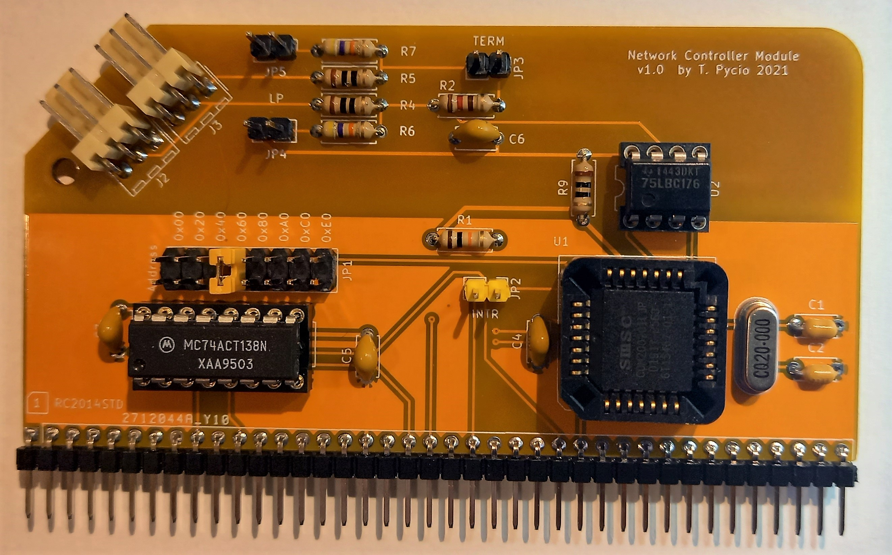

# Network Controller Designed For RC2014

This is a COM20020-based network controller board designed for the RC2014 microcomputer system. The module has been prepared for operation in the CP/Net local area network.

## Bill of Materials

Component type     | Reference  | Description                                  | Quantity |
------------------ | ---------- | -------------------------------------------- | -------- |
PCB                |            | Network Controller PCB - Version 1.1         | 1        |
Integrated Circuit | U1         | COM20020ILJP - Arcnet Controller,28 pin PLCC | 1        |
Integrated Circuit | U2         | SN75176 -  Bus Transceiver, 8 pin DIP        | 1        |
Integrated Circuit | U3         | 74HCT138 - 3-to-8 line decoder, 16 pin DIP   | 1        |
Crystal            | Q1         | 20 MHz, Crystal Oscillator, HC-49S           | 1        |
Diode TVS          | D1 - D3    | SD05C , SOT323                               | 3        |
Pin Header         | J1         | 40 pin header, 2.54 mm pitch, angle          | 1        |
Connector Contacts | J2, J3     | 3 pin header, WF-03R 2.54 mm pitch, angle    | 1        |
Capacitor          | C1, C2     | 27 pF, ceramic, 5 mm pitch                   | 2        |
Capacitor          | C3 - C6    | 0.1 uF, 50V, MLCC, 5 mm pitch                | 4        |
Resistor           | R1         | 10 kohm, 0.25 W, axial                       | 1        |
Resistor           | R2         | 120 ohm, 0.25 W, axial                       | 1        |
Resistor           | R3, R4, R7 | 10 ohm, 0.25 W, axial                        | 3        |
Resistor           | R5, R5     | 47 kohm, 0.25 W, axial                       | 2        |
IC Socket          | U1         | 28 pin PLCC, through hole                    | 1        |
IC Socket          | U2         | 8 pin DIP                                    | 1        |
IC Socket          | U5         | 16 pin DIP                                   | 1        |
Jumper             | JP1        | Shunt, 2x8 pin 2.54 mm pitch                 | 1        |
Jumper             | JP2        | Shunt, 3 pin 2.54 mm pitch                   | 1        |
Jumper             | JP3 - JP5  | Shunt, 2 pin 2.54 mm pitch                   | 3        |

## License

Copyright 2021 Tadeusz Pycio

This work is licensed under a [Creative Commons Attribution-ShareAlike 4.0 International License](http://creativecommons.org/licenses/by-sa/4.0/).
